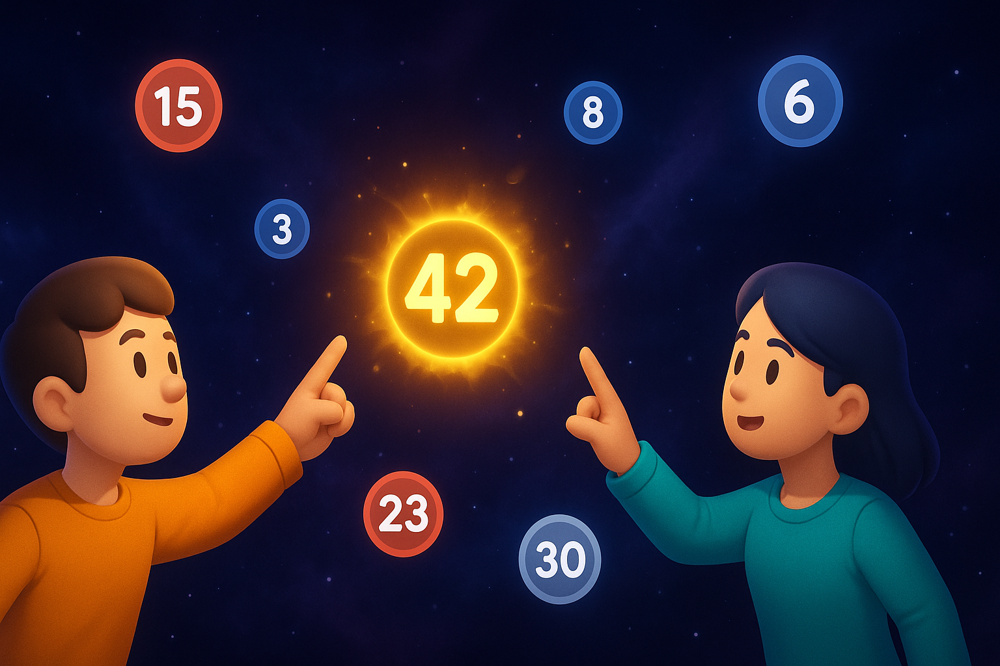

# Find Number

<p align="center">
  
</p>

> Đua tốc độ tìm số trong vũ trụ 3D. Mở link → vào phòng → ai bấm đúng số trước thắng.

<p align="center">
  
</p>

## Chơi sao?

1. Vào trang chủ, gõ nickname.
2. **Create Room** để mời bạn (gửi link), hoặc **Quick Match** để ghép ngẫu nhiên.
3. Mỗi vòng, banner hiện số mục tiêu — ai chạm đúng quả số đó trước, thắng vòng đó.
4. 10 vòng, người thắng nhiều vòng hơn thắng cả trận.
5. Số đã tìm sẽ bị khoanh màu (đỏ P1 / xanh P2) cho cả 2 cùng thấy.

> Không cần đăng nhập. Mở web là chơi.

## Có gì hay

- **3D galaxy scene** — 100 quả số bay trong không gian, xoay quanh được.
- **Mobile-first PWA** — cài vào màn hình chính như app.
- **Race chuẩn** — server quyết người bấm trước, không cheat được.
- **Bảng xếp hạng** — Tuần / Tháng / Năm / Mọi thời điểm.
- **Reconnect** — rớt mạng 10s vẫn quay lại được.

## Chạy local

```bash
pnpm install
pnpm --filter @find-number/worker db:migrate:local
pnpm dev
```

Mở http://localhost:5173

## Deploy

Push lên `main` → GitHub Actions tự deploy CF Worker + Pages.
Cần secrets: `CLOUDFLARE_API_TOKEN`, `CLOUDFLARE_ACCOUNT_ID`.

## Cấu trúc

```
apps/web/        — Vite + R3F PWA
apps/worker/     — CF Worker (Hono + Durable Objects + D1)
packages/shared/ — protocol types dùng chung
```
