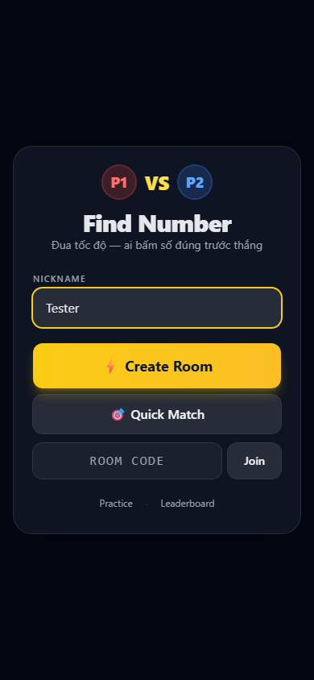
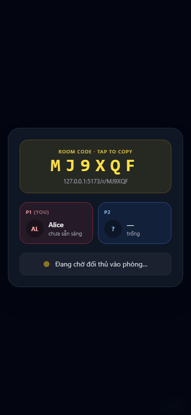
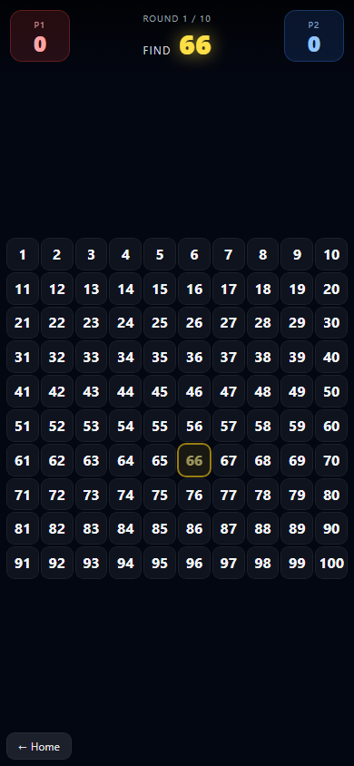
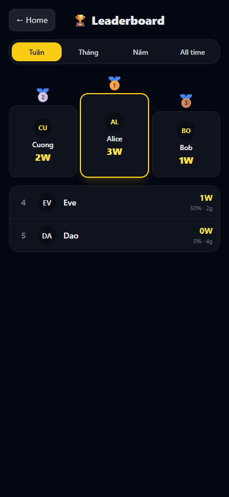

<div align="center">


# Find Number

**1v1 race game · tìm số trong grid · mobile-first PWA**

[](https://find-number.pages.dev)
[](https://github.com/tvtdev94/find-number/actions)
[](https://workers.cloudflare.com)
[](https://vitejs.dev)

</div>

---

> Mở link → vào phòng → server tung số ngẫu nhiên → ai bấm đúng trước thắng vòng đó. **Mỗi vòng grid xáo lại** để bạn không nhớ vị trí mà phải scan thật.

## ✨ Có gì hay

- 🎯 **Grid 10×10** xáo trộn mỗi vòng — bắt mắt nhưng phải tinh
- 👥 **1v1 race** qua link, hoặc **Quick Match** ghép ngẫu nhiên
- 🤖 **Bot AI fallback** — không tìm được người trong 60s? Chiến với máy luôn (bot khó vừa, ~50% win rate)
- 🏆 **Leaderboard** Tuần / Tháng / Năm / All time, podium top 3
- 📱 **PWA** — cài vào màn hình chính, chơi offline lobby
- ⚡ **Race chuẩn server-side** — không cheat được (server arbitrate first-click)
- 🔌 **Reconnect grace 10s** — rớt mạng vẫn quay lại được
- 🎨 **Bundle 72KB gzip** — tải nhẹ, mở 1 phát ăn liền

## 🎮 Cách chơi

1. Vào trang chủ, gõ nickname
2. **Create Room** → share link với bạn, hoặc **Quick Match** → ghép random / vào trận với bot
3. Banner trên cùng hiện số mục tiêu (vd. `FIND 46`)
4. Tap đúng quả số đó trên grid — ai nhanh hơn được điểm
5. Best of 10 vòng. Số đã tìm bị tô màu (🔴 P1 / 🔵 P2)

> Không cần đăng nhập. Mở web là chơi.

## 📸 Screenshots

<table>
  <tr>
    <td align="center"><br/><sub>Landing</sub></td>
    <td align="center"><br/><sub>Lobby</sub></td>
    <td align="center"><br/><sub>In-game</sub></td>
    <td align="center"><br/><sub>Leaderboard</sub></td>
  </tr>
</table>

## 🛠 Stack

| Layer | Tech |
|---|---|
| Frontend | Vite + React 18 + TypeScript + Zustand + Tailwind + vite-plugin-pwa |
| Backend | Cloudflare Workers + Hono + Durable Objects (WS) + D1 (SQLite) + KV |
| Routing | wouter (1KB) |
| Tests | Vitest (unit) + Playwright (E2E) |
| CI/CD | GitHub Actions → Cloudflare auto-deploy |

## 🚀 Chạy local

```bash
pnpm install
pnpm --filter @find-number/worker db:migrate:local
pnpm dev
```

Mở http://localhost:5173

## 📦 Cấu trúc

```
find-number/
├── apps/
│   ├── web/              Vite PWA (React + Tailwind)
│   └── worker/           CF Worker (Hono + DO + D1)
├── packages/
│   └── shared/           Protocol types dùng chung
├── tests/
│   ├── e2e/              Playwright
│   └── visual/           Screenshot helpers
├── plans/                Phase plans + reports
└── docs/                 Hình ảnh, journals
```

## 🔄 Deploy

Push commit lên `main` → GitHub Actions chạy:
1. **Test** — typecheck + 24 unit tests + build
2. **E2E** — Playwright trên Chromium headless
3. **Deploy** — D1 migrate + Worker deploy + Pages deploy

Cần GitHub secrets: `CLOUDFLARE_API_TOKEN`, `CLOUDFLARE_ACCOUNT_ID`

## 🤖 Bot AI

Khi Quick Match queue empty:
- Sau **5s** → button "🤖 Chơi với máy ngay" hiện ra
- Sau **60s** → tự động fall back vào trận với bot

Bot reaction: **1.8–3.5s** delay + **25% miss rate** → fair vs trung bình human (~50% win rate). Bot match **không lên leaderboard**.

## 📜 License

MIT

---

<div align="center">
<sub>Made with Cloudflare Workers · React · Tailwind · ❤️</sub>
</div>
